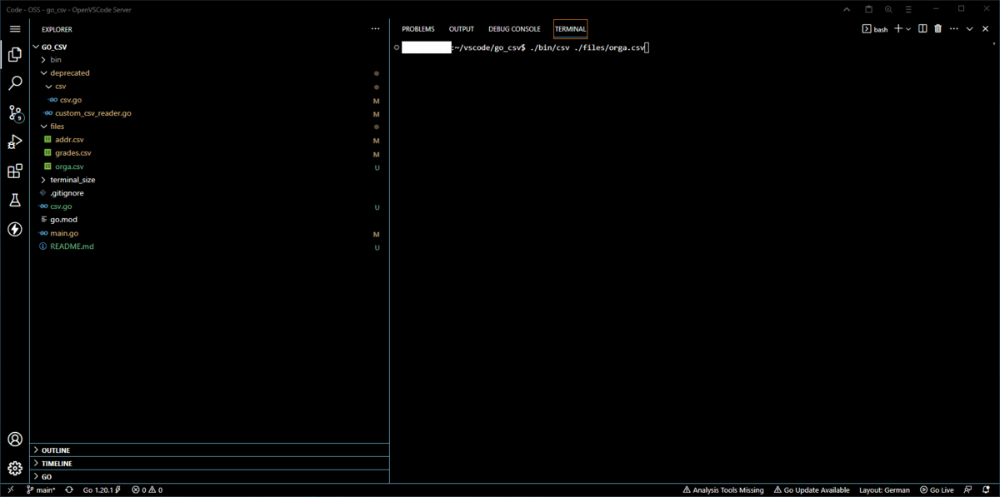

# Minimal .csv preview in Terminal.

## What it does
- small footprint, and quick, you can preview into even big .csv files in the terminal. 
- only linux/unix support for now
- pass in filepath of csv file and optional index of FirstRow to display from
- uses full terminal width and height to display dataset. Colums above Terminal-width get cutt off.

### Parsing improvements over the std.csv lib
- by default trailing spaces after doublequte enclosed fields are not supported and will crash the process. 
- ex: ` "asdf" ,"bbb"` will fail while `asdf , bbb` or ` "asdf",  "bbb"` are ok.
- we changed this and extend the csv Filestream Reader struct with a optional TrimLeadingSpace bool option

## build the binary (golang required, or golang build dockerfile)
- clone the repository cd into the folder
- then build with golang for your target system `go build -o ./bin/csv`

## how to run
- `Binary FilepathToCsv OptionalStartRow`
- `./bin/csv ./files/grades.csv`
- `./bin/csv ./files/orga.csv 456`

